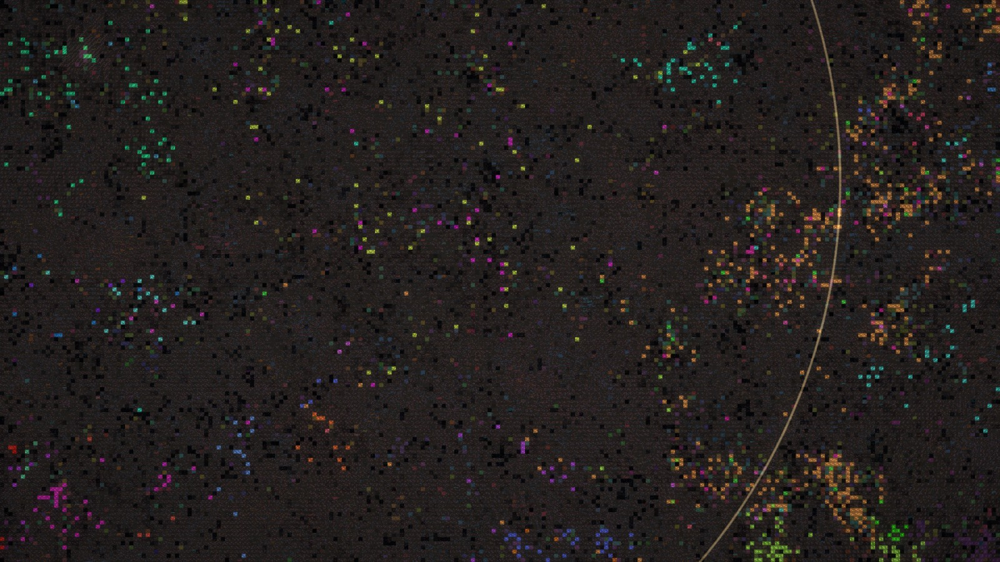

# EX NIHILO

**Two million random bytes. Nobody writes a self-replicating program. One appears anyway.**


Open the page and you are looking at noise: 32,400 tiny programs made of random bytes.
None of them can copy itself, and nothing in the rules rewards copying.
Leave it running. Some time later a program that copies itself exists, then thousands of them, then almost nothing else.
You can zoom in, read its code, and step through it copying itself. Nobody wrote that program.

No install, no build step, no dependencies. It is a static web page.

## What is actually happening

1. **The universe** is a 240 × 135 grid of programs. Each program is 64 bytes. At epoch 0 every byte is random.
2. **Every epoch**, each program is paired with a random neighbour (within two cells). The two 64-byte tapes are glued into one 128-byte tape, and that tape is executed as code. Then it is cut in half and the halves go back to their cells.
3. **The language** has ten instructions. Any other byte value does nothing.

   | | |
   |---|---|
   | `<` `>` | move head 0 left / right |
   | `{` `}` | move head 1 left / right |
   | `-` `+` | decrement / increment the byte under head 0 |
   | `.` | copy the byte under head 0 to head 1 |
   | `,` | copy the byte under head 1 to head 0 |
   | `[` `]` | loop while the byte under head 0 is not zero |

   Code and data are the same tape, so programs can rewrite themselves and each other.
4. **Radiation**: each epoch, each byte has a 1 in 4,096 chance of being replaced by a random one.

That is the whole physics. There is no fitness function, no goal, and no reward.

This is the "primordial soup" of [*Computational Life: How Well-formed, Self-replicating Programs Emerge from Simple Interaction*](https://arxiv.org/abs/2406.19108) (Agüera y Arcas, Alakuijala, Evans, Laurie, Mordvintsev, Niklasson, Randazzo and Versari, 2024), in its 2D form, with the paper's parameters. The paper's own code is C++ and CUDA. This is an independent implementation that runs in a browser tab, and adds the instruments for watching it.

## What happens in the default universe

Every universe is fully determined by its seed. The default one, universe `25`, goes like this on any machine:

| epoch | |
|---|---|
| 0 | 2,073,600 random bytes. By chance, 653 of the 32,400 programs contain a loop and a copy instruction. None of them reproduces. |
| 12,736 | **Life.** A program that passes the replication test holds 35 cells. |
| 14,080 | **Takeover.** Living programs hold more than half of the universe. |
| 16,000 | 91% of cells are alive, split between roughly 1,400 variants that keep overwriting each other. |

| epoch 0: noise | epoch 13,500: about 3% alive | epoch 16,000: 91% alive |
|---|---|---|
|  |  |  |

The first picture shows every byte coloured by instruction. The other two colour each living cell by its lineage and leave everything else dark. Zoomed all the way in, the living universe reads as code:


This is the first living program of universe `25` (dots are bytes that do nothing):

```
······················[····,}<·······]··]·······<},····[········
```

The loop `[····,}<·······]` does three things per turn: `,` copies the byte under head 1 to head 0, `}` moves head 1 one step right, `<` moves head 0 one step left. Head 1 starts at the program's first byte and walks forward through it. Head 0 starts at the same place, steps left off the edge of the tape and wraps around to the far end of the neighbour, then walks backward. So the program writes itself into its neighbour back to front.

A backwards copy of a program is normally garbage. This one works because it contains its loop twice, once forwards and once backwards (`]·······<},····[`), so its mirror image contains a forwards loop too, and copies itself back. Every replicator that has emerged here so far uses some version of this trick.

### Other universes

Not every universe is this lucky, and not every first attempt survives. Of the sixty universes with seeds `1` to `60`, four produced life within 16,000 epochs. Their histories, which you can replay from the "Charted" menu:

| seed | first life | what happens next |
|---|---|---|
| `25` | 12,736 | takeover at 14,080 |
| `39` | 10,864 | spreads slowly; takeover at 21,440 |
| `58` | 14,528 | takeover at 21,184 |
| `21` | 8,208 | extinct at 10,496; life again at 10,944; extinct at 11,712; still lifeless at 68,208 |

Universe `21` shows how fragile the first replicators are. When one of them is the right-hand half of an interaction and its left-hand neighbour does nothing, its own loop runs with the heads pointing at the neighbour, and it copies the neighbour's junk over itself.

The other fifty-six were still noise at epoch 16,000. How many of them wake up later, and when, is what the multiverse lab is for.

## What you can do

- **Zoom** from the whole universe down to single instructions. At full zoom every byte is drawn as its character.
- **Microscope**: click any cell to pull its program out, see whether it is alive, and step through it executing against its neighbour, one instruction at a time.
- **Three views**: the raw code; living cells coloured by species; and activity, which lights up where programs are being overwritten.
- **Hand of god**: drop a meteor (a region returns to noise), wipe a region blank, or inoculate the soup with a replicator. Turn the radiation up or off.
- **Share a universe**: everything is determined by the seed, so a link replays the same history for anyone.
- **Multiverse lab** (`lab.html`): run many universes side by side, one per CPU core, and see which ones wake up.

## Is it real?

Fair question for a page that claims to show the origin of life in a browser tab. What is and is not being claimed:

- **The physics is the paper's.** Same language, same 240 × 135 grid, same neighbourhood, same step budget (8,192), same mutation rate (0.024%).
- **Nothing is planted.** A universe starts as the output of a seeded random number generator and nothing else. The repository does contain one hand-written replicator, the one described in the paper. It is used by the tests and by the Inoculate tool, and it only enters a universe if you click it there; the page then stops saying "nobody wrote them".
- **"Alive" is tested, not guessed.** A program counts as a self-replicator only if, placed next to inert tape, it rebuilds itself there (or builds its mirror image, which then builds it back). The detector never looks for particular code. See [`src/assay.js`](src/assay.js).
- **The complexity graph is independent of that test.** It is the paper's measure, byte entropy minus compressed size per byte, computed with the browser's deflate where the paper uses brotli. It knows nothing about replicators and jumps at the same moment.
- **The numbers are not the paper's.** The paper reports that 40% of its well-mixed soups of 131,072 programs change state within 16,000 epochs. Here 4 of 60 universes of 32,400 programs did. Scaling the paper's figure by soup size would predict about 12%, so this is the same order of magnitude and no more than that: the soups differ (2D against well-mixed) and so does the criterion.
- **The fast interpreter is exact.** The interpreter skips no-ops, fast-forwards provably idle loops and runs on every CPU core. Open [`test.html`](test.html): it checks the fast interpreter against a plain reference implementation on 460,000 tapes, byte for byte, runs a whole universe on both and compares them, and checks that dividing an epoch's work the way the worker threads do gives the same universe as doing it in order.
- **It is deterministic.** The same seed produces the same history, down to the epoch, whatever the machine and however many cores it has. The histories in the table above were charted single-threaded in the lab; the default universe's has been replayed in the 15-thread viewer, with and without shared memory, and comes out the same to the epoch.
- **"Life" is a metaphor with a definition.** These are self-replicating programs in a ten-instruction toy machine. They cannot touch anything outside a 2 MB array.
- **Most universes are slow.** The default seed was picked because it wakes up early. A random universe typically needs tens of thousands of epochs, and some will outlast your patience. The lab page is the way to explore that honestly.

## Running it

It is a static site. Serve the folder with anything:

```bash
npx serve .
```

```bash
python -m http.server 5173
```

On Windows with nothing installed:

```bash
powershell -ExecutionPolicy Bypass -File tools/serve.ps1
```

Then open `http://localhost:5173/`. (Opening `index.html` straight from disk does not work, because browsers refuse to start module workers from `file://`.)

| key | |
|---|---|
| scroll, drag | zoom, pan |
| click | microscope, or the selected tool |
| `Space` | run / pause |
| `S` | one epoch |
| `1` `2` `3` | code / species / activity |
| `F` | fit to screen |
| `N` | new random universe |
| `P` | save a picture |
| `?` | help |

URL parameters: `#seed=anything` picks the universe, `&mut=4096` sets the mutation rate (1 in *x*; 0 turns it off), `&limit=8192` the step budget. `?threads=4` limits the number of CPU threads.

## How it is built

```
index.html, style.css     the viewer
lab.html                  the multiverse lab
test.html                 the test suite (runs in the browser)
sw.js                     service worker that makes shared memory possible on static hosts
src/
  bff.js                  the virtual machine: reference interpreter, fast interpreter, single-stepper
  soup.js                 the grid of programs, epochs, mutation, species census
  pairing.js              who meets whom each epoch
  assay.js                the test for self-replication
  life.js                 history of a universe: births, extinctions, takeover
  known.js                the charted universes
  coordinator.js          worker that drives one universe
  executor.js             workers that run interactions in parallel
  pair-worker.js          worker that computes pairings ahead of time
  metrics.js              worker that measures complexity
  render.js               WebGL2 renderer
  main.js                 the interface
  microscope.js, sound.js, names.js
  lab.js, lab-worker.js   the multiverse lab
  test.js                 the tests
tools/serve.ps1           zero-dependency dev server for Windows
```

A few things that made it fast enough to watch:

- **Idle loops are fast-forwarded.** Random junk is full of accidental infinite loops that burn the whole step budget doing nothing. If the machine returns to the same jump with its heads in the same place and the tape unchanged, its state has repeated and nothing more can happen, so the interpreter stops there. This is exact, not an approximation.
- **No-ops are skipped.** 96% of random bytes are no-ops. Each program carries a 64-bit mask of which bytes are instructions, and the interpreter hops between instructions, charging the skipped bytes to the step budget.
- **Pairs are independent.** Within an epoch no cell is in two pairs, so the interactions can run on all cores at once and still give the same result as running them in order. Who meets whom never depends on the soup, so pairings are computed ahead of time on a thread of their own.
- **Threads share the soup.** Browsers only allow shared memory on "cross-origin isolated" pages, which needs two response headers that static hosts like GitHub Pages cannot set. `sw.js` is a small service worker that adds them. The first visit reloads once to switch it on. If that is not possible the simulation copies data between threads instead and runs two to three times slower while the universe is sterile.

On the 8-core, 16-thread desktop this was written on, the first version ran a sterile universe at about 20 epochs per second per core. The viewer now runs one at 560 to 840, depending on the session, which puts life in the default universe 15 to 23 seconds after you press Watch and the takeover at 19 to 28. Once a universe is alive every interaction is a full copy loop, and it settles at 80 to 90 epochs per second.

## Who wrote this

The viewer, the simulation and this README were written by Claude, an AI model made by Anthropic, in one sitting, at the request of the repository's owner, who asked for something new and provocative and then watched.

The replicators were not written by either of us.

## Licence

MIT. See [LICENSE](LICENSE).
